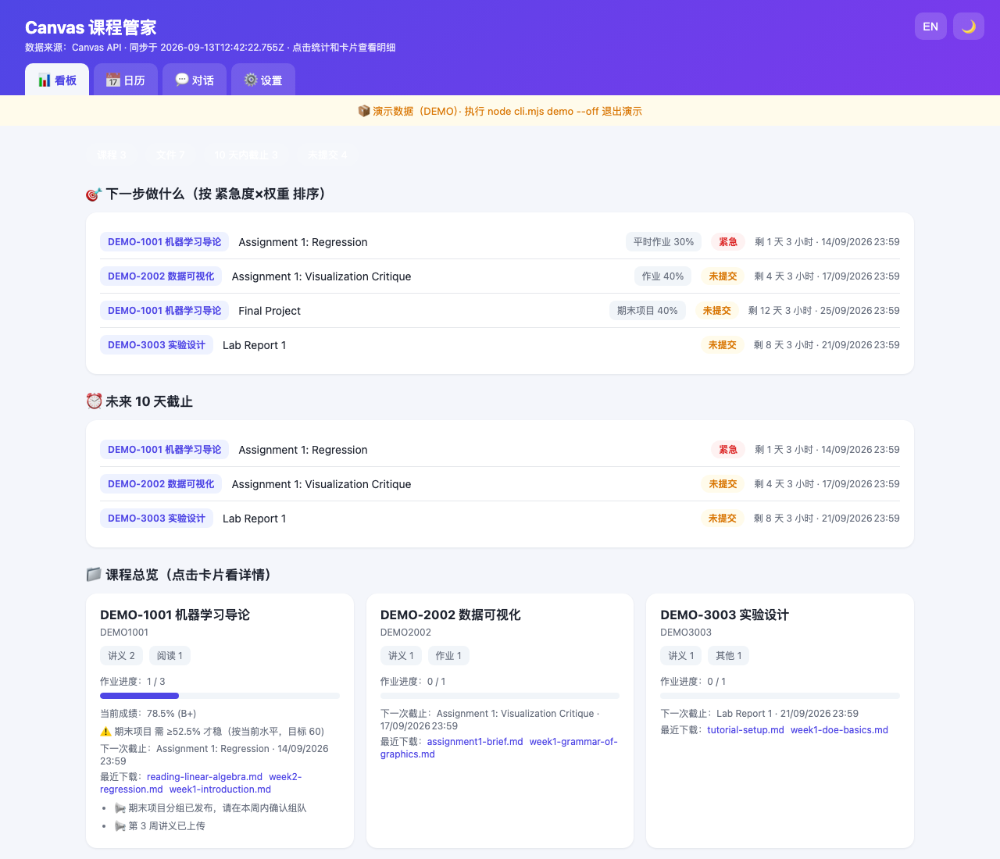
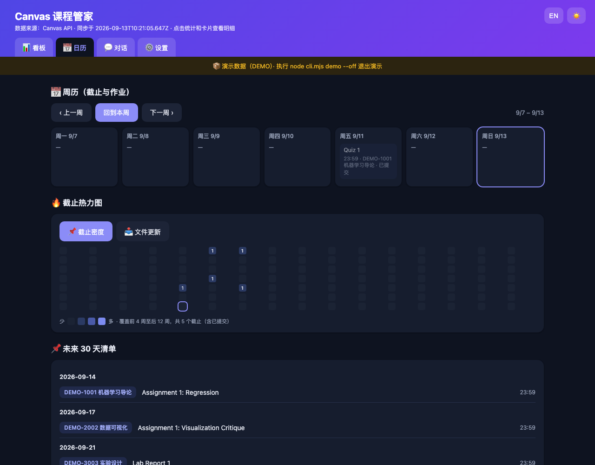
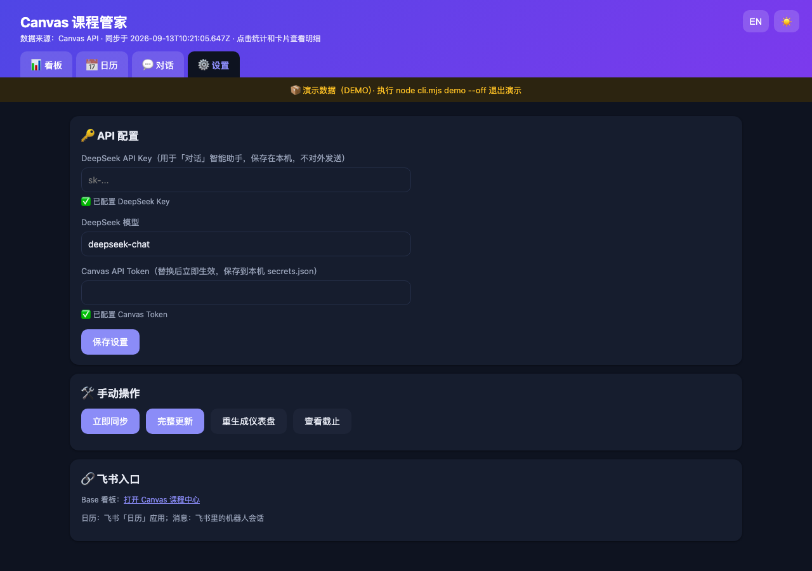
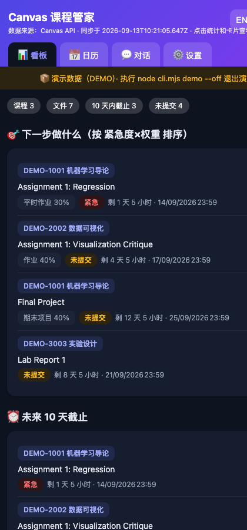
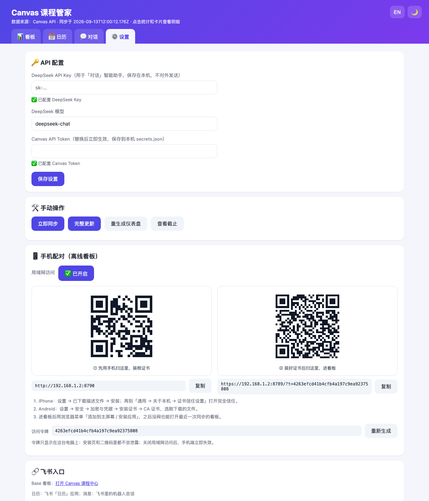

# Canvas Course Hub

> Pulls your Canvas course materials, assignments, grades and announcements onto your own machine, organises them into folders, and surfaces everything in a **web dashboard / Feishu / native notifications** — including syllabus weight parsing, so it can tell you *"what do I need on the final to stay safe?"*

**Everyone runs their own copy**: you supply your own Canvas token, all data stays on your machine, nothing is uploaded anywhere.

📖 [中文说明](README.md)

---

## ✨ Features

- **Sync & organise** — active courses discovered dynamically (new courses get a folder automatically), incremental downloads, classification into `讲义 / 作业 / 阅读 / 其他` (Lecture / Assignment / Reading / Other) with an LLM fallback
- **Dashboard** — course cards, 10-day deadline countdown, new-file feed, click a file name to open it locally; week calendar and a GitHub-style deadline heatmap
- **Grades & planning** — current Canvas scores, assessment weights parsed from your syllabus PDF, "what you need on the final" calculation with two scenarios, and a to-do list ranked by urgency × weight
- **Reminders** — daily sync at 08:00 and deadline check at 20:00 (missed runs catch up on wake), daily digest plus a Sunday weekly report, delivered through native notifications, Feishu messages and Feishu calendar events
- **AI assistant** — ask "which course is most at risk?", "update my data", or "set the final exam weight to 55%"; it calls tools and streams the answer
- **Phone dashboard (PWA)** — open the dashboard on your phone, add it to your home screen, and **keep reading it offline**: a Service Worker caches the app shell plus the latest state, so the next deadline is available on the subway. LAN traffic goes over a local self-signed HTTPS cert with a one-time access token that is only ever shown on your computer
- **Bilingual UI** (Chinese / English), dark mode, mobile-friendly
- **Zero dependencies** — plain Node.js built-ins, no `npm install`

## 📸 Screenshots

| Dashboard: what to do next, deadlines, courses | Calendar: week view + deadline heatmap |
| --- | --- |
|  |  |

| Settings: API keys, manual actions, Feishu | Mobile layout (dark mode included) |
| --- | --- |
|  |  |

| Phone pairing: install the cert, then scan to open |
| --- |
|  |

> Screenshots use built-in demo data — run `node cli.mjs demo` to see the same on your machine.

## 🚀 Quick start

Requirements: **macOS, Windows or Linux** and Node.js 18+. If Node is missing, the installer offers to install it for you (Homebrew on macOS, winget on Windows).

### 1. Get the code

Recommended (easy updates with `git pull`):

    git clone https://github.com/Asaph-L/canvas-hub.git
    cd canvas-hub

Or download a packaged build from [Releases](https://github.com/Asaph-L/canvas-hub/releases):

- **Windows**: download `canvas-hub-*-windows.zip` and unzip it
- **macOS / Linux**: download `canvas-hub-*-macos-linux.tar.gz`, then `tar -xzf canvas-hub-*.tar.gz && cd canvas-hub-*`

### 2. Create a Canvas token

Avatar (top right) → Account → Settings → Approved Integrations → `+ New Access Token` → copy the string.

It is stored only in your local `secrets.json` (mode 600).

### 3. Install

macOS / Linux:

    bash install.sh

Windows (PowerShell):

    powershell -ExecutionPolicy Bypass -File install.ps1

The wizard asks for install directory, course-file directory, Canvas URL/token, an optional DeepSeek key, which features to enable, UI language, and whether to generate demo data. It then runs a first sync, installs scheduled jobs, opens the dashboard at http://127.0.0.1:8788 and finishes with a health check.

### 4. Use it

    node cli.mjs doctor      # health check (run this first when something is off)
    node cli.mjs sync        # sync once
    node cli.mjs demo        # no token yet? generate demo data (demo --off to exit)

## 🖥 Platform support

| Feature | macOS | Windows | Linux |
| --- | --- | --- | --- |
| Sync / archive / dashboard / digest | ✅ | ✅ | ✅ |
| Notifications | ✅ Notification Center | ✅ native toast | ✅ notify-send |
| Scheduling | ✅ launchd | ✅ Task Scheduler | ⚠️ manual crontab |
| Syllabus PDF parsing | ✅ Spotlight + pure JS | ✅ pure JS | ✅ pure JS |
| Feishu integration | ✅ | ✅ | ✅ |
| Phone dashboard (PWA) | ✅ | ✅ | ✅ |

Windows notes: three tasks are created (`CanvasHub-Morning / Evening / Web`). The web task checks every 5 minutes whether the dashboard is alive (a second instance exits immediately when the port is taken), and runs through a VBS wrapper with a hidden window so no console flashes. The first time you enable phone access, Windows Firewall asks whether Node.js may accept connections — choose Allow (LAN only).

## 📱 Phone dashboard (PWA)

The dashboard is useless when you are away from your desk. The phone build puts the same dashboard on your phone and **keeps working without a network**: check the next deadline on the subway, see what each course expects next.

### Three steps

1. **Enable it on the computer** — dashboard → Settings → Phone pairing → toggle **LAN access** (on by default); two QR codes appear
2. **Install the certificate** — connect the phone to the same WiFi and scan the **left** QR code, then follow the on-screen steps (on iPhone also enable full trust under Settings → General → About → Certificate Trust Settings)
3. **Open the dashboard** — scan the **right** QR code; the token is remembered automatically. Use the browser menu "Add to Home screen / Install app" and it keeps working offline

> Why a certificate? Offline support needs a Service Worker, and browsers only allow that in a secure context. A LAN IP can never have a public certificate, so the app generates a **root certificate that belongs only to your computer** (10 years, restricted to private addresses such as `192.168.x.x`). Install it once on the phone — changing WiFi or IP does not require reinstalling it.

### Privacy design

| Mechanism | Detail |
| --- | --- |
| Localhost needs no token | `http://127.0.0.1:8788` is only reachable on your own machine and is not authenticated |
| LAN requires a token | Phones use `https://<your-lan-ip>:8789` with a 32-character random token stored in `data/lan-token.txt` (mode 600) |
| Tokens never leave the computer | The token is shown only on the **computer screen**; the pairing API returns 403 to LAN clients, and the certificate install page never contains it |
| Regenerating invalidates instantly | "Regenerate" in Settings invalidates the old token immediately (phones must re-scan) |
| Private networks only | Requests whose source IP is not in a private range (192.168.x / 10.x / 172.16-31.x) are rejected |
| State data only | The Service Worker caches the app shell and `/api/state` only — **never course files** — so phone data and storage stay tiny |
| Switch it off anytime | Turning LAN access off disconnects phones immediately (no certificate uninstall needed) |

### Ports

| Port | Purpose |
| --- | --- |
| 8788 | Desktop dashboard (HTTP, 127.0.0.1 only) |
| 8789 | Phone dashboard (HTTPS, LAN) |
| 8790 | Certificate install page (HTTP; ships the CA so the phone can download it *before* trusting it) |

Change them in `config.json` if they clash:

    { "web": { "port": 8788, "lanPort": 8789, "helperPort": 8790 } }

> Phones only accept `https://<lan-ip>:<lanPort>`; after changing ports, re-pair by scanning the QR code in the desktop dashboard. `node cli.mjs doctor` reports the status of all three ports and the certificate.

## ⚙️ Optional

### Demo mode (no Canvas token needed)

    node cli.mjs demo          # three fake courses with grades and safety lines
    node cli.mjs demo --off    # restore your real data

### DeepSeek (chat assistant, syllabus parsing, smart classification)

Add your API key under Settings in the dashboard (create one at platform.deepseek.com). Everything else works without it; syllabus parsing degrades to keyword rules. Cost is usage-based — typically a few cents to a couple of dollars per month.

### Feishu (calendar + Bitable + message push)

Why bother: deadlines become Feishu calendar events with reminders, all course data lands in a Bitable, and the daily digest is pushed to a Feishu chat. Entirely optional.

    npx @larksuite/cli@latest install     # install lark-cli
    node cli.mjs lark-setup               # authorise with your own Feishu account
    node cli.mjs lark-init                # create the Bitable and bind it

## 🛠 Commands

| Command | What it does |
| --- | --- |
| `node cli.mjs doctor` | Health check (deps / Canvas / folders / dashboard / phone certificate) with fix suggestions |
| `node cli.mjs daily` | Full pipeline (same as the 08:00 job) |
| `node cli.mjs evening` | Sync + next-day deadline reminder |
| `node cli.mjs sync` | Sync and download only |
| `node cli.mjs analyze [--force]` | Re-parse syllabus assessment weights |
| `node cli.mjs classify [--all]` | Smart classification |
| `node cli.mjs due 10` | Deadlines within 10 days |
| `node cli.mjs demo [--off]` | Demo data on / off |
| `node cli.mjs server` | Run the dashboard in the foreground |

## ❓ FAQ

**Token invalid (HTTP 401)?** Regenerate it in Canvas → Account → Settings → Approved Integrations, then paste it in the dashboard Settings page (or edit `secrets.json`).

**Phone says the certificate is untrusted / cannot connect securely?** The root certificate is not installed or not trusted yet. Connect the phone to the same WiFi and scan the **left** QR code on the pairing page. On iPhone, after installing the profile you must also enable full trust under Settings → General → About → Certificate Trust Settings, otherwise Safari keeps blocking it.

**Phone opens the dashboard but shows "pairing required"?** The request carried no token (you typed the address by hand, or the token was regenerated). Re-scan the **right** QR code from the desktop dashboard.

**Desktop works, phone cannot connect?** Check in order: (1) phone and computer on the same WiFi — many campus networks isolate clients, try a phone hotspot; (2) the computer firewall allows Node.js; (3) run `node cli.mjs doctor`, which reports the LAN port and certificate status directly.

**Windows: `git clone` fails with "Connection was reset"?** If your machine reaches GitHub through a system proxy (Clash / V2Ray on `127.0.0.1:2080` etc.), git does **not** read the Windows system/IE proxy — configure it explicitly:

    git config --global http.proxy  http://127.0.0.1:2080
    git config --global https.proxy http://127.0.0.1:2080

**Windows: `curl` or `Invoke-WebRequest` fails with a schannel credential error?** That is a broken system TLS stack, unrelated to this project: **all network I/O here goes through Node's built-in fetch (bundled OpenSSL + CA store)**, including the installer's Canvas check and dashboard probe, so everything still works.

**Dashboard will not open?** Check the port (`lsof -nP -i :8788` on macOS/Linux, `netstat -ano | findstr 8788` on Windows). If taken, change `web.port` in `config.json` and restart the service.

**Scheduled job did not run?** Run `node cli.mjs doctor` and check `logs/`. On Windows, open Task Scheduler and run the CanvasHub-* task manually.

**My materials live elsewhere.** Point `download.root` in `config.json` at your existing folder; identical files are detected and not re-downloaded.

**How do I uninstall?** `bash uninstall.sh` (macOS/Linux) or `powershell -ExecutionPolicy Bypass -File uninstall.ps1` (Windows) — background jobs are removed, your course files are untouched.

## 🤝 Contributing

Issues and PRs are welcome — please read [CONTRIBUTING.md](CONTRIBUTING.md) first. The core rules: keep it dependency-free, and optional features must degrade gracefully.

## 📄 License

[MIT](LICENSE). If this project helps you, a ⭐ is the best thanks.
