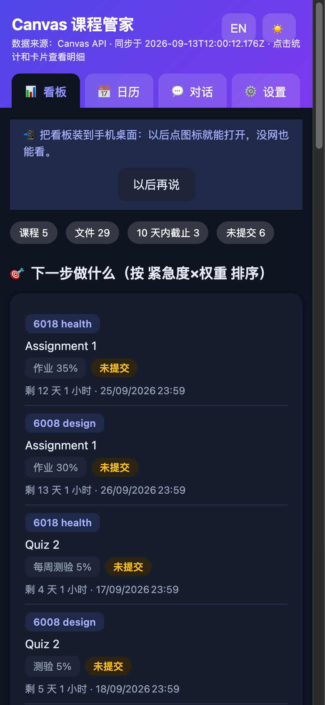
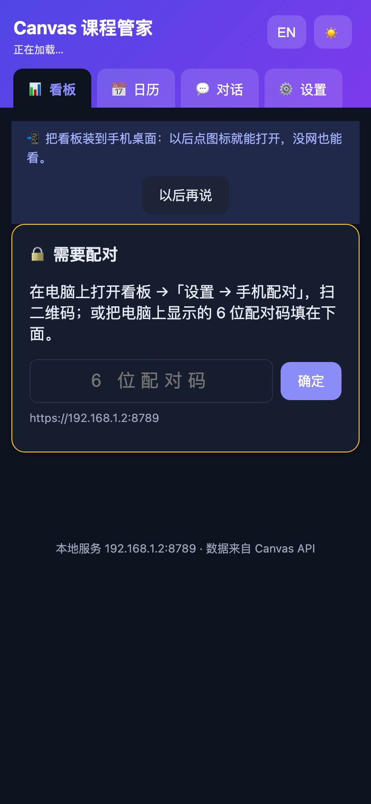

# Canvas 课程管家 (canvas-hub)

> 把 Canvas 上的课程资料、作业、成绩、公告自动抓到本地整理好，并在**网页看板 / 飞书 / 系统通知**里提醒你 —— 还能解析课程大纲的评分权重，告诉你「这门课的期末要考多少分才安全」。

**每个人跑自己的一份**：你填自己的 Canvas Token，数据只存在你自己的电脑上，不经过任何第三方服务器。

📖 [English README](README.en.md) · 🔒 [安全说明](SECURITY.md)

---

## ✨ 核心能力

**📥 抓取与归档**
- 动态课程发现：每次同步从 Canvas 读取在读课程，**新课程出现自动建文件夹**，无需任何配置
- 增量下载：按文件 ID + 更新时间判断，本地已有同名文件不会重复下载
- 分类归档：关键词规则 + DeepSeek 智能兜底，自动分到 `讲义 / 作业 / 阅读 / 其他`

**📊 可视化**
- Web 看板：课程卡片、10 天截止倒计时、新文件流、点击文件名直接打开本地资料
- 日历视图：周历 + GitHub 风格截止热力图（可切换「截止密度 / 文件更新」两种口径）
- 中英双语、深色模式、移动端自适应

**🎯 学业分析**
- 成绩追踪：自动抓取 Canvas 当前分数
- **大纲权重解析**：从 syllabus PDF 提取「作业 30% / 期中 25% / 期末 40%」这样的评分组成
- **安全线倒推**：结合已得成绩，算出「期末考试需要考多少分才能保住总分」，并给出两种口径（其余项按当前水平 / 其余项全满分）
- 行动清单：未完成作业按 **紧急度 × 权重** 排序，告诉你先做什么

**🔔 提醒与自动化**
- 每天 08:00 自动同步，20:00 检查次日截止（错过的任务开机后补跑）
- 每日摘要 + 周日周报（Markdown 归档）
- 三种提醒渠道可自由开关：系统通知（macOS / Windows 原生）、飞书消息、飞书日历日程

**🤖 AI 助手**
- 网页里直接问：「我哪门课最危险？」「期末要考多少分？」「帮我更新一下」
- 支持工具调用：会话里说「更新」它会真的去跑同步并汇报结果
- 也可以一句话改数据：「把 5003 的期末权重改成 55%」

**📱 手机离线看板（PWA）**
- 手机上打开就是看板：课程、截止、日历、热力图全套自适应，可「添加到主屏幕」像 App 一样用
- **断网也能看**：Service Worker 缓存看板外壳 + 最近一次状态数据，地铁里也能查下次截止
- 隐私优先：局域网走**自签 HTTPS + 一次性访问令牌**，令牌只显示在电脑屏幕上，扫码一次即记住，也可随时一键失效

## 📸 界面预览

| 看板：下一步做什么 + 截止 + 课程卡片 | 日历：周视图 + 截止热力图 |
| --- | --- |
|  |  |

| 设置：API / 手动操作 / 飞书入口 | 移动端自适应（深色模式同款布局） |
| --- | --- |
|  |  |

| 手机配对：装证书 / 扫码 / 6 位配对码 | 手机上的看板（可装到主屏幕、离线可用） | 手机上重新配对的入口 |
| --- | --- | --- |
|  |  |  |

> 截图使用内置演示数据生成，执行 `node cli.mjs demo` 即可在你自己的电脑上看到同样的界面。

## 🚀 快速开始

### 前置要求

- **macOS / Windows / Linux** 都可以（定时任务：macOS 用 launchd、Windows 用任务计划程序、Linux 需手动配 crontab）
- Node.js 18+：**没装也没关系**，安装向导会问你要不要自动装（macOS 用 Homebrew、Windows 用 winget）

### 第 1 步：拿到程序

推荐用 git（方便以后 `git pull` 更新）：

    git clone https://github.com/Asaph-L/canvas-hub.git
    cd canvas-hub

或者直接下载打包好的版本（[Releases](https://github.com/Asaph-L/canvas-hub/releases)）：

- **Windows**：下载 `canvas-hub-*-windows.zip` 并解压
- **macOS / Linux**：下载 `canvas-hub-*-macos-linux.tar.gz`，执行 `tar -xzf canvas-hub-*.tar.gz && cd canvas-hub-*`

### 第 2 步：生成 Canvas Token

1. 打开 Canvas 并登录
2. 右上角头像 → 账号 / Account → 设置 / Settings
3. 找到 已批准集成 / Approved Integrations → `+ New Access Token`
4. 用途随便填，生成后复制那串字符（形如 `1839~xxxx`）

> 它只保存在你电脑的 `secrets.json` 里（权限 600），不会外传。

### 第 3 步：一条命令安装

macOS / Linux：

    bash install.sh

Windows（PowerShell）：

    powershell -ExecutionPolicy Bypass -File install.ps1

向导会依次问你：安装目录、课程资料目录、Canvas 地址与 Token、可选的 DeepSeek Key、要开启哪些功能、界面语言、是否生成演示数据。装完会自动同步一次、创建定时任务、打开看板并跑一遍体检。

### 第 4 步：用起来

    node cli.mjs doctor      # 体检，出问题先跑这个
    node cli.mjs sync        # 手动同步一次
    node cli.mjs demo        # 没有 Token？先看演示数据（demo --off 退出）

打开 http://127.0.0.1:8788 即可使用看板 / 日历 / 对话 / 设置。

无人值守安装（批量部署 / 脚本化）

macOS / Linux：

    NONINTERACTIVE=1 \
      CANVAS_TOKEN=你的token \
      FILES_DIR="$HOME/Desktop/CityU-Courses" \
      DEEPSEEK_KEY=sk-xxx \
      ENABLE_MACOS=1 ENABLE_WEB=1 ENABLE_SCHEDULE=1 ENABLE_LARK=0 \
      bash install.sh

Windows：

    $env:NONINTERACTIVE='1'; $env:CANVAS_TOKEN='你的token'
    powershell -ExecutionPolicy Bypass -File install.ps1

## 🖥 平台支持

| 功能 | macOS | Windows | Linux |
| --- | --- | --- | --- |
| 抓取 / 归档 / 看板 / 摘要 | ✅ | ✅ | ✅ |
| 系统通知 | ✅ 通知中心 | ✅ 原生 Toast | ✅ notify-send |
| 定时任务 | ✅ launchd | ✅ 任务计划程序 | ⚠️ 需手动配 crontab |
| 大纲 PDF 解析 | ✅ Spotlight + 纯 JS | ✅ 纯 JS | ✅ 纯 JS |
| 飞书集成 | ✅ | ✅ | ✅ |
| 手机离线看板（PWA） | ✅ | ✅ | ✅ |

> Windows 说明：计划任务会创建 `CanvasHub-Morning / Evening / Web` 三个任务；Web 任务每 5 分钟检查一次服务是否存活（已在运行则新实例立即退出），并通过 VBS 包装成隐藏窗口运行，不会弹黑框。首次开启手机访问时，Windows 防火墙会弹窗询问是否允许 Node.js 联网，选「允许」即可（只影响局域网）。

## 📱 手机离线看板（PWA）

电脑上看板只能坐在电脑前用。手机端把同一份看板放到手机上，**没网也能看**：地铁里刷一下，下次截止、哪门课要交什么，一眼就清楚。

### 三步用起来

1. **电脑上开启**：打开看板 →「设置 → 手机配对」→ 点一下「局域网访问」（默认已开启），出现两个二维码
2. **装证书**：手机连同一个 WiFi，先扫**左边**的二维码 → 按页面提示安装根证书（iPhone 还要在「设置 → 通用 → 关于本机 → 证书信任设置」里打开完全信任）
3. **进看板**：扫**右边**的二维码 → 看板直接打开，令牌自动记住；再用浏览器菜单「添加到主屏幕 / 安装应用」，之后离线也能打开

> 为什么要装证书？手机上要用 Service Worker 实现离线，浏览器强制要求 HTTPS；而局域网 IP 不可能有公网证书。所以程序在本地生成一个**只属于你这台电脑的根证书**（10 年有效，只用于 `192.168.x.x` 这类内网地址），手机装一次就行 —— 换 WiFi、换 IP 都不用重装。

### 以后怎么再打开（三种入口）

扫完二维码不用留着那张图。手机上有三种回到看板的办法，**按推荐顺序**：

1. **装到手机桌面（最推荐）** —— 打开看板后，iPhone 点 Safari 的「分享 → 添加到主屏幕」，Android 点 Chrome 菜单里的「安装应用 / 添加到主屏幕」。之后就像普通 App：**点桌面图标直接进看板，没网也能开**，不会在浏览器标签里迷路。看板顶部也会自己提示这一步。
2. **存个书签** —— 看板地址是 `https://<内网IP>:8789/`；如果电脑的 `.local` 名称可用，配对卡上的「固定地址」（形如 `https://your-mac.local:8789/`）**换 WiFi、换 IP 都不变**，更适合存书签。
3. **配对码兜底** —— 令牌失效时（清了浏览器数据、换了手机、点过「重新生成」）不用再找电脑扫码：照旧打开上面那个地址，配对页会让你输入 **6 位配对码**，把电脑看板「设置 → 手机配对」里显示的数字填进去即可（10 分钟内有效、用一次即废）。

> 为什么装到桌面比存书签更好？iOS 上只有「已添加到主屏幕」的网页才能用完整的离线缓存与通知（iOS 16.4+）；Android 上安装后的 PWA 有独立存储，不会因为清理浏览器数据而丢令牌。

### 安全设计

完整威胁模型与残余风险见 **[SECURITY.md](SECURITY.md)**，要点：

- 本机 `127.0.0.1` 免令牌；局域网必须带 **128 位随机令牌**，且只接受私有网段来源
- 令牌只显示在电脑屏幕上，扫码后立即换成 `HttpOnly` Cookie 并从地址栏抹掉
- 校验 `Host` 头（防 DNS 重绑定）、静态文件做目录包含校验（防路径穿越读 `secrets.json`）
- `X-Frame-Options: DENY` + CSP；看板所有课程数据走 `textContent` 渲染，聊天内容先转义再套 Markdown
- 6 位配对码：限速 + 一次性 + 10 分钟过期
- 自签证书的 SHA-256 指纹会显示在配对卡与安装页，可对照手机系统设置核对，防止证书被替换

### 隐私设计

| 机制 | 说明 |
| --- | --- |
| 本机免令牌 | `http://127.0.0.1:8788` 只在你自己电脑上可访问，不做任何鉴权 |
| 局域网要令牌 | 手机走 `https://<你的内网IP>:8789`，必须带 32 位随机令牌，令牌存在 `data/lan-token.txt`（权限 600） |
| 令牌不外泄 | 令牌只显示在**电脑屏幕**的配对页；手机端访问配对接口直接返回 403；证书安装页里也不含令牌 |
| 换令牌即失效 | 设置页点「重新生成」立刻作废旧令牌（旧手机需重新扫码） |
| 仅限内网 | 来源 IP 不属于私有网段（不是 192.168.x / 10.x / 172.16-31.x）直接拒绝 |
| 只缓存状态数据 | Service Worker 只缓存看板外壳和 `/api/state`，**不缓存课程文件**，手机流量与存储开销极小 |
| 随时可关 | 设置页关掉「局域网访问」，手机端立刻连不上（无需卸载证书） |

### 端口占用

| 端口 | 用途 |
| --- | --- |
| 8788 | 本机看板（HTTP，仅 127.0.0.1） |
| 8789 | 手机看板（HTTPS，局域网） |
| 8790 | 证书安装页（HTTP，只发证书，方便手机在「信任之前」下载 CA） |

端口被占用时可在 `config.json` 里改：

    { "web": { "port": 8788, "lanPort": 8789, "helperPort": 8790 } }

> 手机端只认 `https://<内网IP>:<lanPort>`；改了端口要用电脑上看板里的二维码重新配对。`node cli.mjs doctor` 会检查这三个端口和证书状态。

## ⚙️ 可选功能

### 先看演示数据（不需要 Canvas Token）

    node cli.mjs demo          # 生成 3 门假课程 + 成绩与安全线示例
    node cli.mjs demo --off    # 退出演示，恢复真实数据

### DeepSeek（对话助手 / 大纲解析 / 智能分类）

在网页「设置」里填入 API Key 即可（到 platform.deepseek.com 创建）。不填也能正常同步、归档、提醒，大纲解析会退化为关键词规则。

> 费用：按量计费，日常大概每月几毛到几块钱；首次解析课程大纲时会一次性消耗稍多。

### 飞书（日历 + 多维表格 + 消息推送）

**装上会更好用吗？** 会：截止日期自动变成飞书日历日程（提前 1 天 / 1 小时提醒），课程数据同步进多维表格可筛选可统计，每日摘要直接推到飞书会话。**不装也完全不影响**其它功能。

    npx @larksuite/cli@latest install     # 安装 lark-cli
    node cli.mjs lark-setup               # 用自己的飞书账号授权（会打印链接与二维码）
    node cli.mjs lark-init                # 创建多维表格并绑定

## 🛠 命令一览

| 命令 | 作用 |
| --- | --- |
| `node cli.mjs doctor` | 环境体检（依赖 / Canvas / 资料目录 / 看板 / 手机端证书 + 修复建议） |
| `node cli.mjs daily` | 完整流程：同步 → 大纲解析 → 智能分类 → 摘要 → 看板 → 日历 → Base → 推送 |
| `node cli.mjs evening` | 晚间同步 + 次日截止提醒 |
| `node cli.mjs sync` | 只同步下载 |
| `node cli.mjs analyze [--force]` | 重新解析大纲评分组成 |
| `node cli.mjs classify [--all]` | 智能分类 |
| `node cli.mjs due 10` | 查看 10 天内截止 |
| `node cli.mjs demo [--off]` | 演示数据开 / 关 |
| `node cli.mjs server` | 前台启动 Web 看板 |

## ❓ 常见问题

**Q：提示 Token 无效（HTTP 401）？**
Canvas Token 过期了。在 Canvas → 账号 → 设置 → 已批准集成重新生成，然后在网页「设置」页粘贴新的（或直接改 `secrets.json`）。

**Q：Web 看板打不开？**
先看端口是否被占用：macOS / Linux 用 `lsof -nP -i :8788`，Windows 用 `netstat -ano | findstr 8788`。被占用就改 `config.json` 的 `web.port`，然后重启服务（macOS：`launchctl kickstart -k gui/$(id -u)/com.canvashub.web`；Windows：在任务计划程序里运行 CanvasHub-Web）。

**Q（Windows）：`git clone` 报 `Connection was reset` 连不上 GitHub？**
如果你的机器靠系统代理（Clash / V2Ray 之类，形如 `127.0.0.1:2080`）上网，git **不会**读取 Windows 的 IE/系统代理设置，需要显式告诉它：

    git config --global http.proxy  http://127.0.0.1:2080
    git config --global https.proxy http://127.0.0.1:2080

**Q（Windows）：`curl` / `Invoke-WebRequest` 报 schannel 凭证错误？**
那是 Windows 系统 TLS 栈的问题，与本项目无关：**本项目的所有网络请求都走 Node 自带的 fetch（内置 OpenSSL 与 CA），不依赖 curl / schannel**。安装向导的 Canvas 校验与看板探活也都用 Node 完成，所以这类机器上功能完全正常。

**Q（Windows）：看板打不开 / 打开是空白？**
1. 先看端口有没有人在听：`netstat -ano | findstr :8788`；没有输出说明服务没起来
2. 手动触发一次计划任务：`schtasks /Run /TN CanvasHub-Web`，然后等 3 秒刷新页面
3. 还不行就在程序目录里前台启动看报错：`node server.mjs`（日志也会写到 `logs/launchd-web.log`）
4. 端口被占用就改 `config.json` 里的 `web.port`，然后重新运行 `install.ps1`

**Q：定时任务没跑？**
运行 `node cli.mjs doctor` 看提示；日志在 `logs/` 目录。Windows 可在「任务计划程序」里右键任务手动运行一次。

**Q：我的课程资料已经在别的文件夹了？**
把 `config.json` 的 `download.root` 指向那个目录即可，同名文件会被识别、不会重复下载。

**Q：新加的课没有自动出现？**
课程一在 Canvas 上发布就会自动建文件夹；也可以手动跑 `node cli.mjs sync`。

**Q：大纲权重不对 / 解析不出来？**
确认课程文件夹里有文件名含 `syllabus` 的 PDF 或 HTML，然后 `node cli.mjs analyze --force`。也可以在网页对话里直接说「把 5002 的评分组成设为 作业 40%、期末 60%」。

**Q：手机扫码后提示「证书不受信任 / 无法建立安全连接」？**
根证书还没装好或没被信任。手机要先连**同一个 WiFi**，扫配对页**左边**那个二维码进安装页；iPhone 装完描述文件后，还必须去「设置 → 通用 → 关于本机 → 证书信任设置」把 `canvas-hub Local CA` 打开完全信任，否则 Safari 依然会拦截。

**Q：手机能打开，但显示「需要配对」？**
说明这次访问没带上令牌（直接手输地址，或令牌被重新生成过）。回到电脑看板「设置 → 手机配对」，用手机重扫**右边**那个二维码即可。

**Q：电脑上看板正常，手机上连不上？**
按顺序排查：① 手机和电脑是否在同一 WiFi（不少校园网会隔离设备，可换手机热点试）；② 电脑防火墙是否放行了 Node.js；③ 运行 `node cli.mjs doctor`，它会直接告诉你局域网端口与证书的状态。

**Q：怎么完全卸载？**
macOS / Linux 用 `bash uninstall.sh`，Windows 用 `powershell -ExecutionPolicy Bypass -File uninstall.ps1` —— 只移除后台任务，不会删你的课程资料。

## 🏗 它是怎么工作的

    同步（cli.mjs sync）
      └─ Canvas API → 课程/模块/文件/作业/公告/成绩
           ├─ 增量判断（data/state.json）
           ├─ 分类（关键词 → DeepSeek 兜底）→ 落到 <课程>/<讲义|作业|阅读|其他>/
           └─ 大纲解析（纯 JS PDF 提取 → DeepSeek 结构化）→ 评分权重 + 安全线

    产出
      ├─ out/web/          交互式看板（日历 / 对话 / 设置，SSE 流式）
      ├─ out/digest/       每日摘要 + 周报
      ├─ 飞书              日历日程 / 多维表格 / 消息卡片
      └─ 系统通知          macOS 通知中心 / Windows Toast

    调度（scripts/schedule.mjs 统一抽象）
      ├─ macOS   launchd（08:00 daily / 20:00 evening / 常驻 web）
      ├─ Windows 任务计划程序（同上，Web 每 5 分钟自愈）
      └─ Linux   crontab（打印配置，需手动加入）

项目**零第三方依赖**，只用 Node 内置模块，不需要 `npm install`。

## 🗺 路线图

- [x] Canvas 抓取、增量下载、分类归档
- [x] Web 看板 + 日历周视图 + 截止热力图
- [x] 成绩追踪 + 大纲权重解析 + 安全线倒推
- [x] 行动清单（紧急度 × 权重）
- [x] 飞书三件套（日历 / 多维表格 / 消息）
- [x] AI 对话助手（工具调用 + 流式输出）
- [x] 一键安装、环境体检、演示模式、中英双语、深色模式
- [x] Windows / Linux 跨平台
- [ ] 语义搜索（跨文件 / 公告 / 作业的自然语言检索）
- [ ] 按作业自定义提醒时间
- [ ] 讨论区与小测追踪
- [x] PWA（手机主屏、离线看板）— v1.0.1 已完成

## 🤝 贡献

欢迎提 Issue 和 PR！提交前请读一下 [CONTRIBUTING.md](CONTRIBUTING.md)，核心原则是**保持零依赖**、可选功能要能优雅降级。

## 📄 许可

[MIT](LICENSE) · 自由使用、修改、分发。

如果这个项目帮到了你，给个 ⭐ 就是最好的支持。
